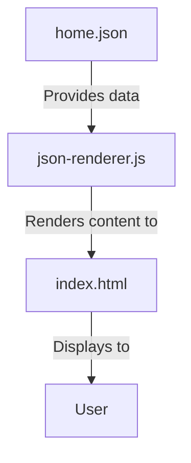

# JSON-Based Web Application Implementation Summary

## Overview

This project implements a comprehensive web application architecture where all content, assets, and configuration data are centralized in a single `home.json` file. This approach provides several benefits:

1. **Separation of Content and Presentation**: Content is stored separately from the HTML structure
2. **Centralized Management**: All content is managed in one place
3. **Flexibility**: Easy to update content without changing HTML
4. **Scalability**: Structure supports multiple pages and future expansion

## Architecture Components

The architecture consists of three main components:

### 1. Data Layer (`home.json`)

A comprehensive JSON file that contains:
- Global configuration (meta tags, styling, header, footer, modals)
- Page-specific content (home page, shop page, etc.)
- Product data
- UI text and translations

### 2. Presentation Layer (`index.html`)

A minimal HTML shell that:
- Loads required CSS and JavaScript
- Contains empty containers for dynamic content
- Provides loading and error states

### 3. Logic Layer (`json-renderer.js`)

JavaScript that:
- Fetches the JSON data
- Renders content into the appropriate containers
- Handles user interactions
- Manages error states and loading

## Implementation Files

| File | Purpose |
|------|---------|
| `home.json` | Contains all content and configuration data |
| `index.html` | Minimal HTML shell with containers for dynamic content |
| `json-renderer.js` | Fetches and renders content from the JSON file |

## Implementation Process

1. **Create `home.json`**:
   - Structure follows the comprehensive schema outlined in the implementation guide
   - Includes all content currently in the static HTML
   - Organizes content into logical sections (global, pages, etc.)

2. **Create `index.html`**:
   - Minimal HTML structure with containers for dynamic content
   - Loads required CSS and JavaScript
   - Includes loading and error states

3. **Create `json-renderer.js`**:
   - Fetches the JSON data
   - Renders content into the appropriate containers
   - Initializes functionality (sliders, modals, etc.)
   - Handles errors and loading states

## Benefits of This Approach

1. **Maintainability**: Content updates require changes to only one file
2. **Consistency**: Global elements are defined once and reused
3. **Scalability**: Easy to add new pages or sections
4. **Performance**: Single JSON fetch rather than multiple API calls
5. **Flexibility**: Can be extended to support multiple languages and themes

## Next Steps for Implementation

1. **Create the Files**:
   - Create `home.json` with all content from the current site
   - Create or modify `index.html` to serve as a shell
   - Create `json-renderer.js` to fetch and render content

2. **Testing**:
   - Test in multiple browsers
   - Verify responsive behavior
   - Check performance

3. **Optimization**:
   - Minify JavaScript and CSS
   - Optimize images
   - Consider caching strategies

4. **Future Enhancements**:
   - Add support for multiple pages
   - Implement routing
   - Add shopping cart functionality
   - Implement user authentication

## Conclusion

This architecture provides a solid foundation for a modern, maintainable web application. By centralizing content in a JSON file and using JavaScript to render it dynamically, we create a flexible system that can grow with the business needs while maintaining the current visual design and user experience.

The detailed implementation guide provides all the code and instructions needed to implement this architecture successfully.